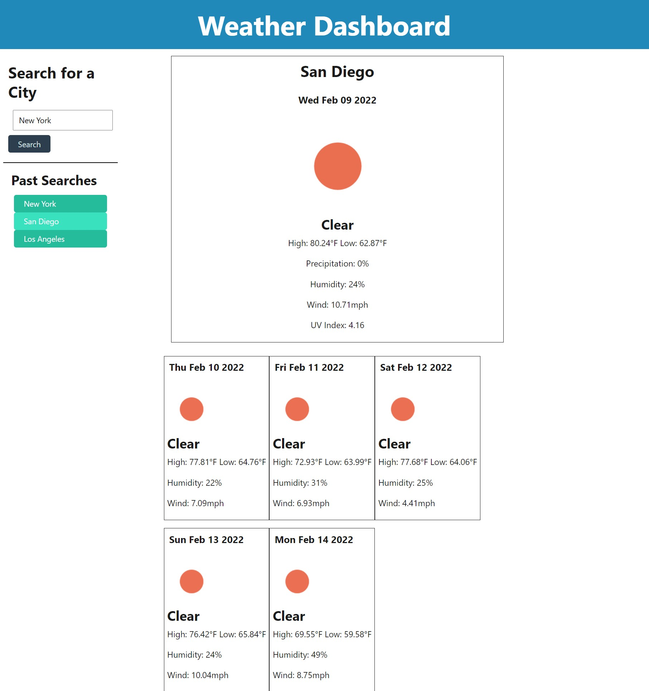

# Weather Magic

[link to website](https://kashane1.github.io/weather-magic/)
-----------
Following the link above will bring you to the Weather Magic!

-----------
Requirements:
-----------

1. The user is presented with a weather dashboard with an input
2. After they search for a city, they can see the weather for that day and a 5 day forecast
3. The weather shows an icon of weather conditions, the temperature, the humidity, the wind speed, and the UV index
4. There is also a 5-day forecast with similar weather information
5. The search history is also able to bring up past cities and their weather data


-----------
Process:
-----------
I enjoyed the process of this homework assignment because felt very close to what a real life project might require of me. I'm happy to be working with third party APIs even if they are a bit challenging at first. After some extra studying and a few youtube videos, I was able to get this API to do exactly what I wanted it to. The most challenging part was working with multiple API calls. I also made other small mistakes, typos really, that had me hung up for hours. It was a great practice in debugging and trying not to get too frustrated. 

-----------
```
preview of Weather Magic!:
```


-----------
Cited:
-----------
https://www.youtube.com/ - for API tutorials

https://www.youtube.com/watch?v=WZNG8UomjSI&t=1428s - for more specific openweathermap API help

https://api.jquery.com/ - for jquery references

https://getbootstrap.com/docs/4.6/getting-started/introduction/ - for bootstrap documentation

-----------